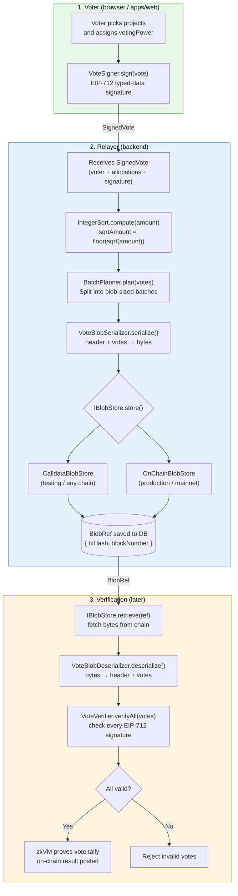
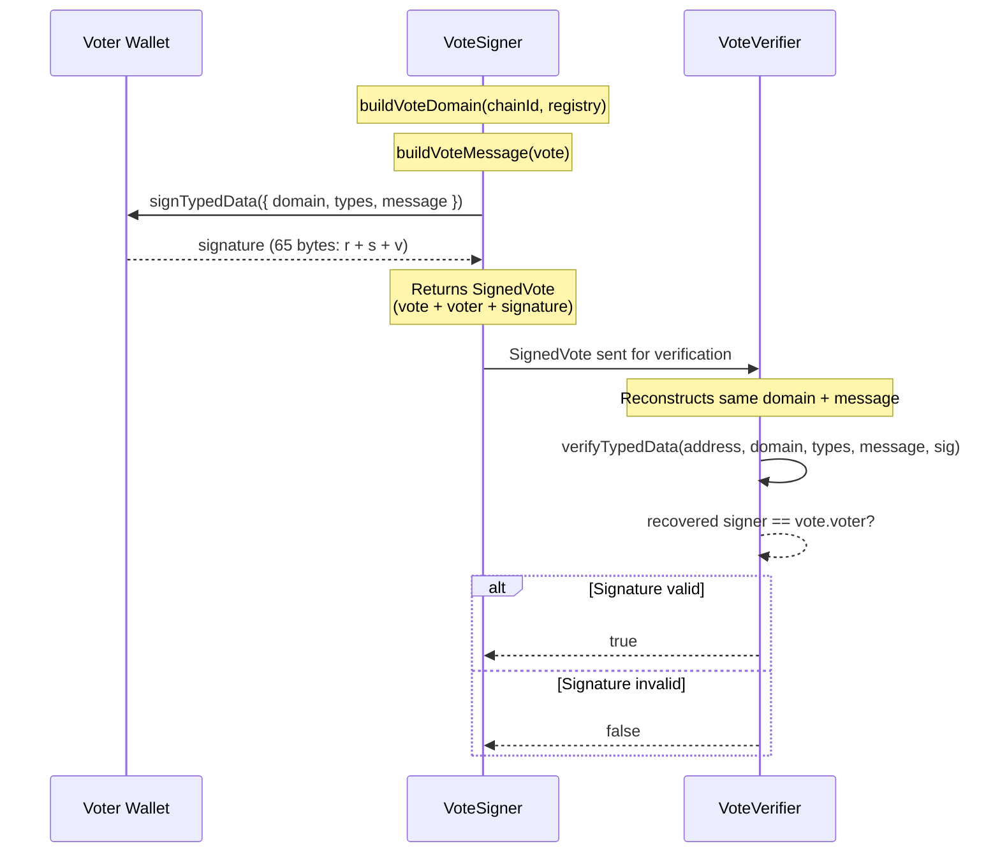

# @octant/vote-blob

Binary serialization library for packing QF votes into EIP-4844 blobs, with EIP-712 signing/verification and a pluggable storage abstraction.

## Concepts

| Term | Definition |
|------|-----------|
| **Blob (EIP-4844)** | A 128 KB data sidecar attached to a type-3 Ethereum transaction. Blobs are cheap (~10x less than calldata), retained on-chain for ~18 days, then pruned. We use them to post vote data to L1 without paying full calldata costs. |
| **Round** | A QF voting round. Voters allocate votingPower to options (project proposals) within a round. Each round has a `roundId` (bytes32), open/close blocks, and a set of options. |
| **Allocation** | A single assignment within a vote: "I spend X votingPower on option Y". Contains `optionId`, `amount`, and `sqrtAmount`. |
| **Amount (votingPower)** | The quadratic cost a voter pays for an allocation. This is the `amount` field — the raw votingPower spent. Aligns with `contribution` in ProperQF.sol. |
| **sqrtAmount** | The effective vote weight: `floor(sqrt(amount))`. In quadratic voting, spending 100 votingPower gives 10 effective votes. The relayer computes this; the zkVM verifies it. Aligns with `sumSquareRoots` in ProperQF.sol. |
| **SignedVote** | A voter's complete ballot: allocations + EIP-712 signature + voter address + nonce. This is what the relayer receives and packs into blobs. |
| **BlobRef** | A reference containing everything needed to retrieve a stored blob: `txHash`, `blockNumber`, `blobIndex`, and optional `versionedHash`. Abstracts away the retrieval complexity. |

## Architecture

```
packages/vote-blob/src/
├── signing/                 # EIP-712 sign + verify
│   ├── VoteSigner.ts        # Sign votes with a WalletClient
│   └── VoteVerifier.ts      # Verify signature matches voter
│
├── serialization/           # Encode/decode vote data to binary
│   ├── BinaryWriter.ts      # Chainable binary encoder
│   ├── BinaryReader.ts      # Chainable binary decoder
│   ├── BlobHeaderCodec.ts   # Encode/decode 128-byte blob header
│   ├── VoteBlobSerializer.ts    # header + votes → Uint8Array
│   └── VoteBlobDeserializer.ts  # Uint8Array → header + votes
│
├── storage/                 # Store/retrieve blob data (Strategy pattern)
│   ├── IBlobStore.ts        # Interface + BlobRef type
│   ├── CalldataBlobStore.ts # Stores as regular calldata (any EVM chain)
│   └── OnChainBlobStore.ts  # Stores as EIP-4844 blobs (mainnet)
│
├── merkle/                  # Balance snapshot proofs
│   └── BalanceMerkleTree.ts # OpenZeppelin StandardMerkleTree wrapper
│
├── batch/                   # Blob capacity + batching
│   └── BatchPlanner.ts      # Split votes into blob-sized batches
│
└── math/                    # Voting math
    └── IntegerSqrt.ts       # floor(sqrt(n)) via Newton's method
```

### Import Aliases

All internal imports use path aliases instead of relative paths:

| Alias | Maps to |
|-------|---------|
| `@signing/*` | `src/signing/*` |
| `@serialization/*` | `src/serialization/*` |
| `@storage/*` | `src/storage/*` |
| `@merkle/*` | `src/merkle/*` |
| `@batch/*` | `src/batch/*` |
| `@math/*` | `src/math/*` |

Configured in `tsconfig.json` (editor) and `tsconfig.build.json` (compilation). The build step uses `tsc-alias` to resolve aliases to relative paths in the compiled output.

## Full Pipeline: Vote → Blob → Chain → Verify



> **Sign** a vote with EIP-712 → **serialize** to binary → **store** on-chain → **retrieve** later → **deserialize** → **verify** signatures → **prove** in zkVM.

## Quick Start

Full example: sign, serialize, store, retrieve, deserialize, verify.

```typescript
import {
  VoteSigner,
  VoteVerifier,
  VoteBlobSerializer,
  VoteBlobDeserializer,
  CalldataBlobStore,
  BatchPlanner,
  IntegerSqrt,
  BalanceMerkleTree,
} from '@octant/vote-blob';
import type { BlobHeader } from '@octant/vote-types';
import { BLOB_MAGIC } from '@octant/vote-types';
import { createWalletClient, createPublicClient, http } from 'viem';
import { privateKeyToAccount } from 'viem/accounts';
import { mainnet } from 'viem/chains';

// ── 1. Setup clients ────────────────────────────────────────────────

const account = privateKeyToAccount('0x...');
const walletClient = createWalletClient({ account, chain: mainnet, transport: http() });
const publicClient = createPublicClient({ chain: mainnet, transport: http() });

const CHAIN_ID = 1;
const REGISTRY = '0xYourRegistryAddress...' as `0x${string}`;

// ── 2. Sign votes (frontend / voter side) ───────────────────────────

const signer = new VoteSigner(walletClient, CHAIN_ID, REGISTRY);

const signedVote = await signer.sign({
  roundId: '0xabc...', // bytes32 round identifier
  allocations: [
    { optionId: 0, amount: 4900n, sqrtAmount: IntegerSqrt.compute(4900n) }, // 70n
    { optionId: 1, amount: 900n,  sqrtAmount: IntegerSqrt.compute(900n) },  // 30n
  ],
  nonce: 0,
});

// ── 3. Batch + serialize (relayer side) ─────────────────────────────

const allVotes = [signedVote];
const { batches } = BatchPlanner.plan(allVotes);

const header: BlobHeader = {
  magic: BLOB_MAGIC,
  roundId: signedVote.roundId,
  batchNonce: 0,
  voteCount: batches[0].length,
  chainId: BigInt(CHAIN_ID),
  registryAddress: REGISTRY,
  numOptions: 5,
  snapshotBlock: 18_000_000n,
  balanceRoot: BalanceMerkleTree.build([
    { voter: account.address, balance: 10000n },
  ]).root,
};

const blob = VoteBlobSerializer.serialize(header, batches[0]);

// ── 4. Store on-chain ───────────────────────────────────────────────

const store = new CalldataBlobStore(walletClient, publicClient, '0xdead...');
const ref = await store.store(blob, header);
// Save ref to your database for later retrieval

// ── 5. Retrieve + deserialize ───────────────────────────────────────

const rawBytes = await store.retrieve(ref);
const { header: decodedHeader, votes } =
  VoteBlobDeserializer.deserializeWithRound(rawBytes);

// ── 6. Verify signatures ────────────────────────────────────────────

const verifier = new VoteVerifier(CHAIN_ID, REGISTRY);
const results = await verifier.verifyAll(votes);

for (const { vote, valid } of results) {
  if (!valid) throw new Error(`Invalid signature from ${vote.voter}`);
}
```

## Signing

### What is EIP-712?

EIP-712 is a standard for signing structured data with Ethereum wallets. Instead of signing a raw hash (which users can't read), the wallet displays a human-readable message like:

```
Vote
  Round: 0xabc...
  Allocations:
    Option 0: 4900 votingPower
    Option 1: 900 votingPower
  Nonce: 0
```

The signature is tied to a specific **domain** (chain ID + registry address), so a signature from mainnet can't be replayed on a testnet.

### VoteSigner

Creates EIP-712 signatures for votes. Requires a viem `WalletClient` with an account attached (the voter's wallet).

```typescript
import { VoteSigner, IntegerSqrt } from '@octant/vote-blob';
import { createWalletClient, http } from 'viem';
import { privateKeyToAccount } from 'viem/accounts';
import { mainnet } from 'viem/chains';

// 1. Create a wallet client with the voter's account
const walletClient = createWalletClient({
  account: privateKeyToAccount('0xYourPrivateKey...'),
  chain: mainnet,
  transport: http(),
});

// 2. Initialize the signer with chain ID and registry address
//    These two values define the EIP-712 "domain" — they prevent
//    signatures from being replayed across different chains or contracts
const signer = new VoteSigner(walletClient, 1, '0xRegistryAddress...');

// 3. Sign a vote
const signedVote = await signer.sign({
  roundId: '0xabc...',                                          // which round
  allocations: [
    { optionId: 0, amount: 4900n, sqrtAmount: 70n },           // project 0: 4900 tokens
    { optionId: 1, amount: 900n,  sqrtAmount: 30n },           // project 1: 900 tokens
  ],
  nonce: 0,                                                     // prevents replay
});

// What you get back:
// signedVote.voter       → '0xf39F...'  (the wallet address)
// signedVote.signature   → '0x7871...'  (65 bytes: r + s + v)
// signedVote.roundId     → '0xabc...'
// signedVote.allocations → [{ optionId: 0, amount: 4900n, sqrtAmount: 70n }, ...]
// signedVote.nonce       → 0
```

**What happens inside `sign()`:**

1. Builds the EIP-712 domain: `{ name: "OctantVote", version: "1", chainId, verifyingContract: registry }`
2. Builds the message from the vote data (roundId, allocations, nonce)
3. If any allocation is missing `sqrtAmount`, computes it: `IntegerSqrt.compute(amount)`
4. Calls `walletClient.signTypedData()` — this is what triggers the wallet popup
5. Returns a `SignedVote` with the signature and the voter's address

### VoteVerifier

Verifies that a `SignedVote` was actually signed by the claimed `voter` address. This is a pure cryptographic check — it recovers the signer's public key from the signature and compares it to `vote.voter`.

```typescript
import { VoteVerifier } from '@octant/vote-blob';

// Basic verifier (ECDSA only — fast, no RPC needed)
const verifier = new VoteVerifier(1, '0xRegistryAddress...');

// Verify a single vote
const isValid = await verifier.verify(signedVote);
// true  → the signature was produced by signedVote.voter
// false → the signature is invalid or was produced by a different address

// Verify many votes at once (runs in parallel)
const results = await verifier.verifyAll([vote1, vote2, vote3]);
for (const { vote, valid } of results) {
  console.log(`${vote.voter}: ${valid ? 'OK' : 'INVALID'}`);
}
```

**Smart contract wallets (EIP-1271):**

Some wallets (like Gnosis Safe) don't use a private key. They verify signatures on-chain via the `isValidSignature()` method. To support these, pass a `PublicClient`:

```typescript
import { createPublicClient, http } from 'viem';
import { mainnet } from 'viem/chains';

const publicClient = createPublicClient({ chain: mainnet, transport: http() });

// Verifier with EIP-1271 fallback (supports smart contract wallets)
const verifier = new VoteVerifier(1, '0xRegistry...', publicClient);

// verify() will:
// 1. Try ECDSA recovery first (fast, no RPC)
// 2. If that fails, call isValidSignature() on-chain (for smart wallets)
const isValid = await verifier.verify(signedVote);
```

### How signing and verification work together



The key insight: the **signer** and **verifier** both build the exact same EIP-712 domain and message. The signer uses a private key to create the signature; the verifier recovers the public key from the signature and checks it matches the claimed voter address. If anyone tampers with the vote data, the recovered address won't match.

## Storage

### The Problem: You Can't Just "Get a Blob"

EIP-4844 blobs are NOT stored like regular transaction data. There is no `getBlob(hash)` method:

```
┌─────────────────────────────────────────────────────────────────┐
│                    EXECUTION LAYER (your normal RPC)             │
│                                                                  │
│  eth_getTransaction(txHash) returns:                             │
│    ✅ from, to, value, input (calldata), gas...                 │
│    ✅ blobVersionedHashes (list of hashes)                      │
│    ❌ actual blob data ← NOT HERE                               │
│                                                                  │
│  The execution layer only stores blob HASHES, not blob DATA.    │
└─────────────────────────────────────────────────────────────────┘

┌─────────────────────────────────────────────────────────────────┐
│                    CONSENSUS LAYER (beacon chain)                │
│                                                                  │
│  Blob data lives here as "sidecars" separate from blocks.       │
│                                                                  │
│  Retrieval endpoint:                                             │
│    GET /eth/v1/beacon/blob_sidecars/{block_number}              │
│                                                                  │
│  Returns ALL blobs for that block. You match yours by index.    │
│                                                                  │
│  ⚠️  Blobs are PRUNED after ~18 days (4096 epochs).             │
│      After that, you need an archival service like Blobscan.    │
└─────────────────────────────────────────────────────────────────┘
```

### The Solution: IBlobStore (Strategy Pattern)

We hide this complexity behind a simple interface:

```typescript
interface IBlobStore {
  store(data: Uint8Array, header: BlobHeader): Promise<StoredBlob>;
  retrieve(ref: BlobRef): Promise<Uint8Array>;
}
```

The caller never thinks about **how** storage works:

```typescript
const ref = await store.store(data, header);   // store → get reference
const data = await store.retrieve(ref);         // reference → get data back
```

Two implementations exist:

```
┌───────────────────────────────────────────────────────────────────┐
│                         IBlobStore                                 │
│                   store(data) → BlobRef                            │
│                   retrieve(ref) → Uint8Array                       │
└──────────────────────────┬────────────────────────────────────────┘
                           │
            ┌──────────────┴──────────────────┐
            │                                 │
┌───────────▼────────────┐     ┌──────────────▼───────────────────┐
│  CalldataBlobStore     │     │  OnChainBlobStore                │
│                        │     │                                   │
│  Stores data as        │     │  Stores data as EIP-4844 blob    │
│  regular tx.input      │     │  (type-3 transaction)            │
│  calldata.             │     │                                   │
│                        │     │  Retrieves via Beacon API:       │
│  Retrieves by reading  │     │  GET /eth/v1/beacon/             │
│  tx.input directly.    │     │    blob_sidecars/{blockNumber}   │
│                        │     │  → match by blobIndex            │
│  ✅ Works on ANY chain │     │                                   │
│  ✅ Anvil, Tenderly    │     │  ⚠️  Requires EIP-4844 support   │
│  ✅ No beacon node     │     │  ⚠️  Requires beacon node        │
│                        │     │  ⚠️  18-day pruning window       │
└────────────────────────┘     └───────────────────────────────────┘
```

### CalldataBlobStore

Stores serialized vote blobs as regular calldata in transactions. Works on **any** EVM chain — Anvil, Tenderly, testnets, mainnet. This is the implementation used for development and testing.

**How it works:**

```
STORE                               RETRIEVE
─────                               ────────
Uint8Array                          BlobRef { txHash }
    │                                   │
    ▼                                   ▼
bytes → hex calldata                eth_getTransaction(txHash)
    │                                   │
    ▼                                   ▼
send tx to targetAddress            read tx.input (hex)
    │                                   │
    ▼                                   ▼
wait for receipt                    hex → Uint8Array
    │                                   │
    ▼                                   ▼
StoredBlob { txHash,                Uint8Array ✅
  blockNumber, blobIndex: 0 }
```

```typescript
import { CalldataBlobStore } from '@octant/vote-blob';
import { createWalletClient, createPublicClient, http } from 'viem';
import { privateKeyToAccount } from 'viem/accounts';
import { mainnet } from 'viem/chains';

// 1. Create clients
const account = privateKeyToAccount('0xYourPrivateKey...');
const walletClient = createWalletClient({ account, chain: mainnet, transport: http() });
const publicClient = createPublicClient({ chain: mainnet, transport: http() });

// 2. Create the store
//    targetAddress = where to send the tx (e.g. 0xdead for testing)
const store = new CalldataBlobStore(walletClient, publicClient, '0x000...dEaD');

// 3. Store serialized vote data
const storedBlob = await store.store(serializedBytes, header);
// storedBlob.txHash       → '0xeb47c1ff...'
// storedBlob.blockNumber  → 23774067n
// storedBlob.blobIndex    → 0  (always 0 for calldata)
// storedBlob.data         → Uint8Array (the original bytes)

// 4. Later, retrieve it using just the reference
const ref = {
  txHash: storedBlob.txHash,
  blockNumber: storedBlob.blockNumber,
  blobIndex: storedBlob.blobIndex,
};
const data = await store.retrieve(ref);
// data is identical to the original serializedBytes
```

### OnChainBlobStore

Production implementation that stores data as real EIP-4844 blobs. Requires Ethereum mainnet (post-Dencun) and a Beacon API endpoint.

**How retrieval works:**

```
RETRIEVE
────────
BlobRef { blockNumber, blobIndex, versionedHash }
    │
    ▼
GET /eth/v1/beacon/blob_sidecars/{blockNumber}
    │
    ▼
Returns ALL blobs for that block:
  [{ index: 0, blob: "0x...", kzg_commitment, kzg_proof },
   { index: 1, blob: "0x...", kzg_commitment, kzg_proof },
   ...]
    │
    ▼
Find sidecar where index === blobIndex
    │
    ▼
Decode blob field elements → Uint8Array
    │
    ▼
Uint8Array ✅
```

```typescript
import { OnChainBlobStore } from '@octant/vote-blob';

const store = new OnChainBlobStore(walletClient, publicClient, 'http://localhost:5052');

// Retrieve a blob stored earlier
const data = await store.retrieve({
  txHash: '0x...',
  blockNumber: 18000000n,
  blobIndex: 0,
  versionedHash: '0x01...',
});
```

> **Note:** `store()` is not yet implemented in OnChainBlobStore — it throws an error directing you to use CalldataBlobStore for testing. This will be implemented when the project moves to mainnet EIP-4844 transactions.

### BlobRef: What Gets Saved to the Database

When you store a blob, you get back a `StoredBlob`. You save a subset of its fields as a `BlobRef` in your database. Later, you pass this `BlobRef` to `retrieve()` to get the data back.

```typescript
interface BlobRef {
  txHash: `0x${string}`;          // identifies the transaction
  blockNumber: bigint;             // for Beacon API query
  blobIndex: number;               // which blob in the block (0 for calldata)
  versionedHash?: `0x${string}`;  // KZG hash (EIP-4844 only)
}
```

Each storage implementation uses different fields:

| Field | CalldataBlobStore | OnChainBlobStore |
|-------|:-:|:-:|
| `txHash` | reads tx.input | - |
| `blockNumber` | - | queries Beacon API |
| `blobIndex` | - | matches sidecar |
| `versionedHash` | - | integrity check |

## Serialization

### BinaryWriter / BinaryReader

Chainable binary encoder/decoder with auto-tracking position. All integers are big-endian.

```typescript
import { BinaryWriter, BinaryReader } from '@octant/vote-blob';

// Write
const buf = new Uint8Array(128);
new BinaryWriter(buf)
  .uint32(0x514D5631)       // 4 bytes: magic number
  .hex(roundId, 32)         // 32 bytes: roundId
  .uint32(batchNonce)        // 4 bytes: batchNonce
  .uint16(voteCount);        // 2 bytes: voteCount

// Read
const r = new BinaryReader(buf);
const magic = r.uint32();    // reads 4 bytes, advances position
const roundId = r.hex(32);   // reads 32 bytes, advances position
```

### BlobHeaderCodec

Encodes/decodes the 128-byte blob header:

```
Offset  Size  Field
──────  ────  ─────────────
  0      4    magic          (0x514D5631 = "QMV1")
  4     32    roundId        (bytes32)
 36      4    batchNonce     (uint32)
 40      2    voteCount      (uint16)
 42      8    chainId        (uint64)
 50     20    registryAddress (address)
 70      1    numOptions     (uint8)
 71      8    snapshotBlock  (uint64)
 79     32    balanceRoot    (bytes32)
111     17    reserved       (zero-padded)
```

```typescript
import { BlobHeaderCodec } from '@octant/vote-blob';

const buf = BlobHeaderCodec.encode(header);  // Uint8Array(128)
const header = BlobHeaderCodec.decode(buf);  // BlobHeader
BlobHeaderCodec.validate(header);            // throws on invalid
```

### VoteBlobSerializer / VoteBlobDeserializer

Serialize and deserialize complete blobs (header + votes):

```typescript
import { VoteBlobSerializer, VoteBlobDeserializer } from '@octant/vote-blob';

// Serialize: header + votes → binary
const bytes = VoteBlobSerializer.serialize(header, votes);

// Deserialize: binary → header + votes
const { header, votes } = VoteBlobDeserializer.deserialize(bytes);

// Deserialize with round info (populates roundId on each vote from header)
const { header, votes } = VoteBlobDeserializer.deserializeWithRound(bytes);

// Estimate byte size before serializing
const size = VoteBlobSerializer.estimateSize(votes);
```

## Merkle

Builds a Merkle tree of voter balances for on-chain proof verification. Uses OpenZeppelin's `StandardMerkleTree` so proofs are compatible with the on-chain `MerkleProof.verify()` contract.

```typescript
import { BalanceMerkleTree } from '@octant/vote-blob';

// Build a tree from voter balances
const tree = BalanceMerkleTree.build([
  { voter: '0xAlice...', balance: 5000n },
  { voter: '0xBob...',   balance: 3000n },
]);

// Get the root hash (goes into the blob header)
tree.root;  // '0x...' (bytes32)

// Generate a proof for a specific voter
const proof = tree.getProof('0xAlice...');

// Verify a proof (can also be done on-chain)
BalanceMerkleTree.verify(tree.root, '0xAlice...', 5000n, proof);  // true

// Dump/load for persistence
const dump = tree.dump();                   // JSON-serializable
const restored = BalanceMerkleTree.load(dump);
```

## Batch

Splits a list of votes into blob-sized batches. Each blob has a maximum capacity determined by `BLOB_USABLE_BYTES` (the 128 KB blob size minus the 128-byte header).

```typescript
import { BatchPlanner } from '@octant/vote-blob';

// How many votes fit in one blob? (depends on allocations per vote)
BatchPlanner.maxVotesPerBlob(5);  // 498 votes with 5 allocations each

// Should we flush the buffer? (true when >= 94% of one blob's capacity)
BatchPlanner.shouldFlush(bufferedVotes);  // true or false

// Split votes into batches (max 6 blobs per transaction)
const { batches, remaining } = BatchPlanner.plan(allVotes);
// batches    → SignedVote[][] (each array fits in one blob)
// remaining  → SignedVote[] (overflow that didn't fit in 6 blobs)
```

## Math

```typescript
import { IntegerSqrt } from '@octant/vote-blob';

IntegerSqrt.compute(4900n);           // 70n  — floor(sqrt(4900))
IntegerSqrt.compute(100n);            // 10n  — floor(sqrt(100))
IntegerSqrt.compute(2n);              // 1n   — floor(sqrt(2))

IntegerSqrt.validate(4900n, 70n);    // true  — 70*70 = 4900 ≤ 4900
IntegerSqrt.validate(4900n, 71n);    // false — 71*71 = 5041 > 4900
```

## Running Tests

```bash
# Run all unit tests (158 tests)
pnpm --filter @octant/vote-blob test

# Run E2E storage roundtrip tests (requires RPC_URL)
RPC_URL=http://127.0.0.1:8545 pnpm --filter @octant/vote-blob test -- src/storage/__tests__/e2e/

# Run E2E against Tenderly
RPC_URL=https://virtual.mainnet.rpc.tenderly.co/YOUR_ID pnpm --filter @octant/vote-blob test -- src/storage/__tests__/e2e/

# Run with verbose output
pnpm --filter @octant/vote-blob test -- --reporter=verbose
```

### Test Breakdown

| Directory | Tests | What it covers |
|-----------|-------|----------------|
| `signing/__tests__/VoteSigner.test.ts` | 6 | EIP-712 signing: format, voter, fields, sqrt, determinism |
| `signing/__tests__/VoteVerifier.test.ts` | 10 | Verify valid, tampered voter/sig/data, wrong chain/registry, batch |
| `serialization/__tests__/BinaryWriter.test.ts` | 26 | Writer: uint8-128, hex, bytes, chaining, property-based |
| `serialization/__tests__/BinaryReader.test.ts` | 12 | Reader: uint8-128, hex, bytes, remaining |
| `serialization/__tests__/BlobHeaderCodec.test.ts` | 16 | Header encode/decode, validation, property-based |
| `serialization/__tests__/VoteBlobSerializer.test.ts` | 8 | Vote size, estimate, error handling |
| `serialization/__tests__/VoteBlobDeserializer.test.ts` | 9 | Roundtrip: single/multi vote, edge cases |
| `serialization/__tests__/roundtrip.test.ts` | 4 | Property-based roundtrip, determinism |
| `storage/__tests__/CalldataBlobStore.test.ts` | 5 | Store/retrieve mocks, error cases |
| `storage/__tests__/e2e/storage.e2e.test.ts` | 3 | Full pipeline E2E: sign → serialize → store → retrieve → deserialize → verify |
| `merkle/__tests__/BalanceMerkleTree.test.ts` | 17 | Build, proof, verify, dump/load, property-based |
| `batch/__tests__/BatchPlanner.test.ts` | 15 | Capacity, flush, plan, batch splitting |
| `math/__tests__/IntegerSqrt.test.ts` | 27 | Newton's method, property-based invariants |

## Build

```bash
pnpm --filter @octant/vote-blob build
```

The build step runs `tsc --build tsconfig.build.json` followed by `tsc-alias` to resolve path aliases in the compiled output.

## Dependencies

| Package | Type | Purpose |
|---------|------|---------|
| `@octant/vote-types` | dependency | Shared types, schemas, constants |
| `@openzeppelin/merkle-tree` | dependency | Merkle tree (compatible with on-chain OZ `MerkleProof`) |
| `viem` | peer | Ethereum types, wallet/public clients for storage and signing |
| `tsc-alias` | dev | Resolves path aliases in compiled output |
| `fast-check` | dev | Property-based testing |
